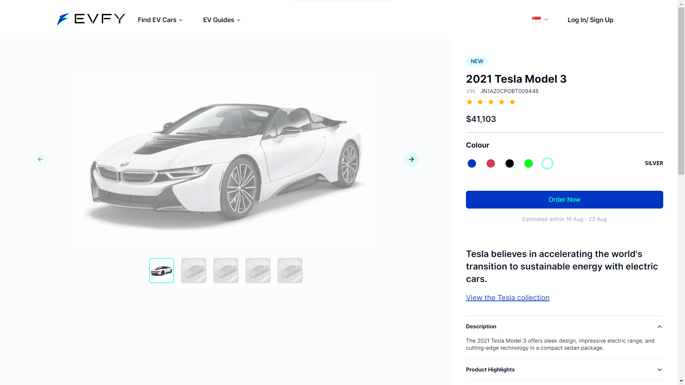
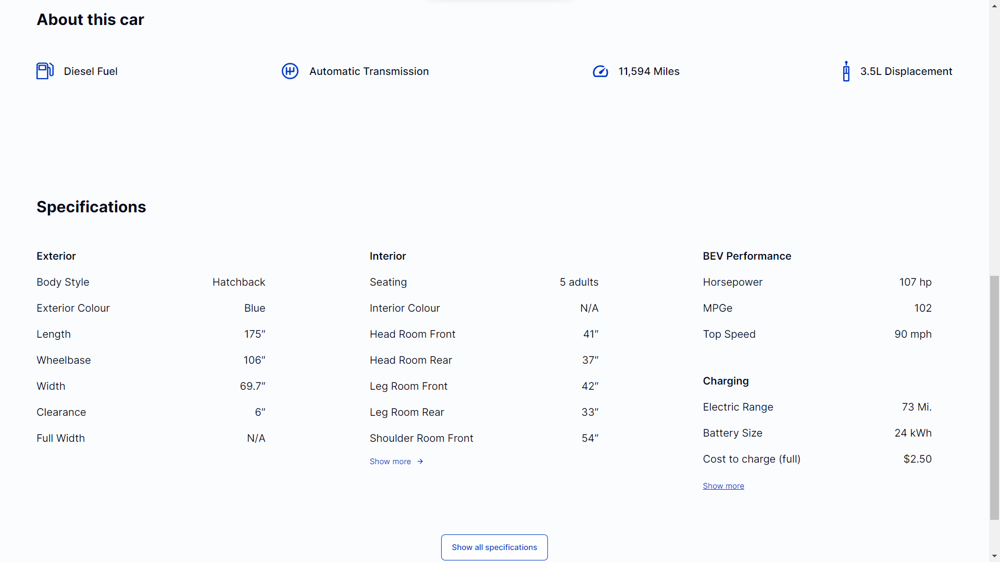

# EVFY - Electric Vechicle For You


## Screenshots




## Live URL

[Link to Live Demo](https://envy-onex.vercel.app/)

## How to Run

To run this project locally, follow these steps:

1. Clone the repository:
   ```sh
   https://github.com/NishantCoder108/onex-rswe-assessment-2024-starter.git
   ```

2. Navigate to the project directory:
   ```sh
   cd onex-rswe-assessment-2024-starter
   ```
   
3. Install dependencies:
   ```sh
   npm install
   ```
   
3. Start the development server:
   ```sh
   npm run dev
   ```
   
4. Open your browser and navigate to `http://localhost:3000` to view the app.


.
